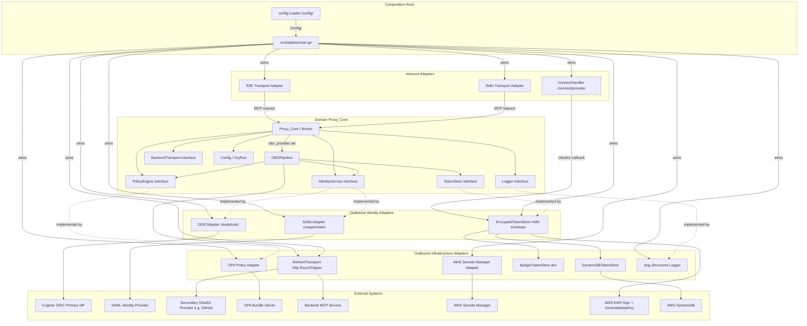
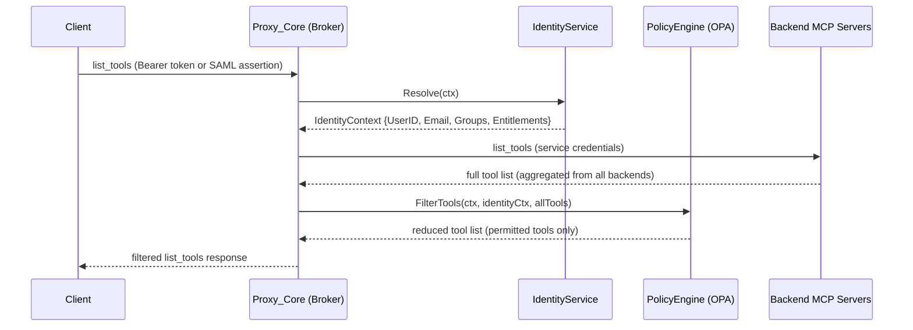
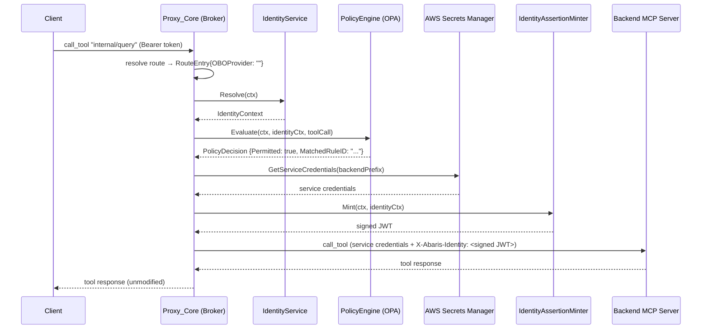
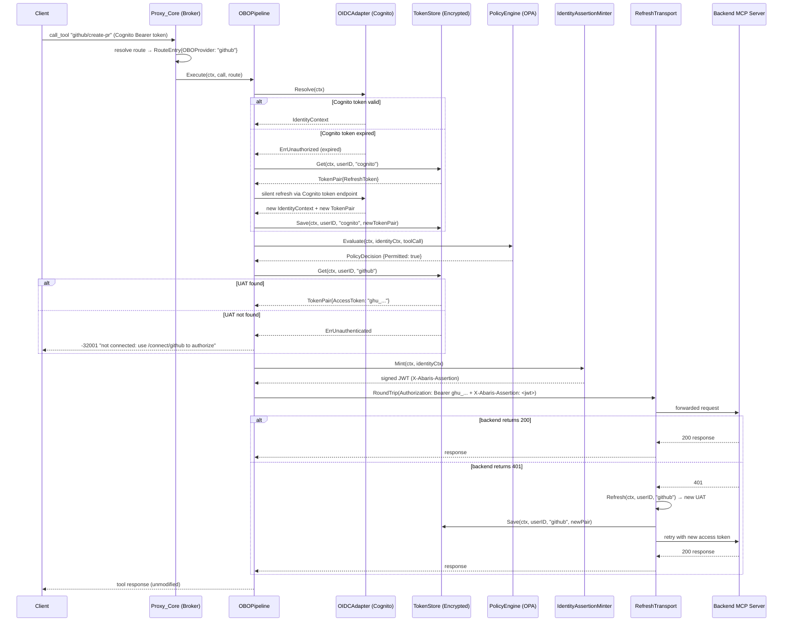
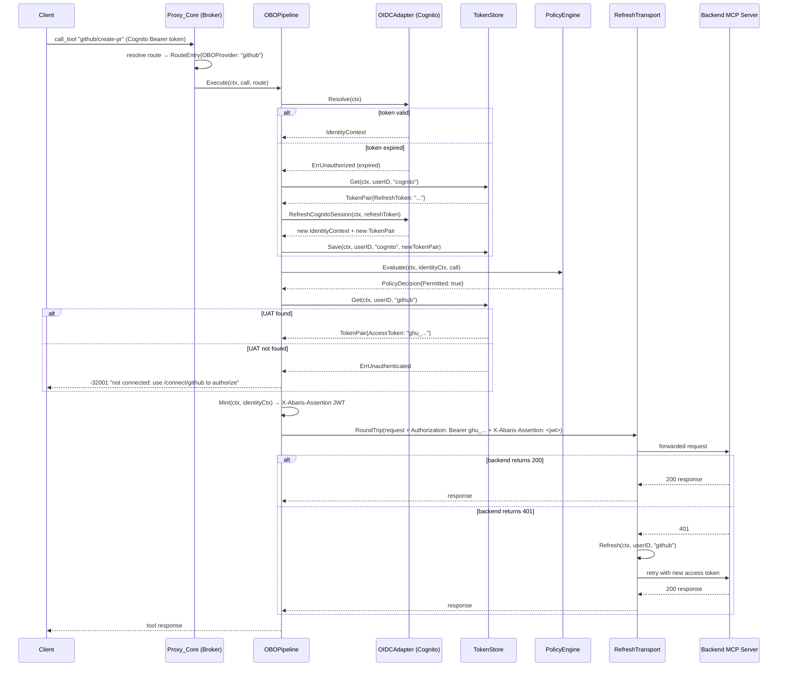

# Design Document: Abaris MCP Proxy

## Overview

Abaris is a high-performance, identity-aware MCP (Model Context Protocol) Broker written in Go. It is the explicit, named endpoint that AI/LLM clients connect to. It sits between those clients and internal enterprise backend MCP tool servers, intercepting every request to enforce federated identity validation and group-based access control before any request reaches a backend.

The core flow for every request is:

1. Receive an MCP JSON-RPC 2.0 request (Stdio or SSE transport)
2. Extract and validate the caller's credential (OIDC Bearer token or SAML assertion) → produce `IdentityContext`; if the Cognito access token is expired, silently refresh it using the stored Cognito refresh token
3. For `list_tools` (Discovery): aggregate tool lists from all backends, filter by `IdentityContext` groups via OPA → return reduced tool list
4. For `call_tool` (Execution): evaluate the tool call against OPA Rego policies → if permitted, choose the forwarding path based on the route's `obo_provider` setting:
   - **Standard route** (no `obo_provider`): mint a KMS-signed `X-Abaris-Identity` JWT and forward using Abaris's own service credentials
   - **OBO route** (`obo_provider` set): retrieve the user's downstream UAT from the encrypted Token Store, mint a KMS-signed `X-Abaris-Assertion` JWT, and forward with `Authorization: Bearer <UAT>` + `X-Abaris-Assertion`; on HTTP 401 from the backend, refresh the UAT once and retry
5. Return the backend response (or a typed error) to the client

The caller's raw Cognito token is **never** forwarded to backend servers. For standard routes Abaris uses its own service credentials; for OBO routes it uses the user's own downstream token retrieved from the encrypted Token Store (DynamoDB or BadgerDB, with KMS envelope encryption at rest).

The design follows Hexagonal Architecture: `Proxy_Core` depends only on Go interfaces; all infrastructure (OIDC adapter, SAML adapter, OPA SDK, SSE/Stdio transports, AWS SDK) is wired at the composition root. All routing, identity provider, and policy configuration is expressed in a modular Config_Directory: `config/identity.yaml`, `config/routing.yaml`, and `config/policies/*.yaml` (one file per group or policy set). The `config.Loader` deep-merges all policy files at startup and hot-reloads the `policies/` directory at runtime via `fsnotify`.

---

## Architecture

### Hexagonal Architecture Diagram



### Broker Flow: Discovery (list_tools)



### Broker Flow: Execution (call_tool) — Standard Route



### Broker Flow: Execution (call_tool) — OBO Route



The `Config` schema and `DryRun` function live in the domain layer alongside `Proxy_Core`. They are pure Go — no infrastructure imports — so they can be used in CLI tooling, tests, and the composition root alike.

---

## Go Package Structure

```
github.com/[username]/abaris/
├── cmd/
│   └── abaris/
│       └── main.go          # composition root — wires all adapters from /config/
├── config/                  # sample config files (shipped with the binary image)
│   ├── identity.yaml        # identity_providers section
│   ├── routing.yaml         # routes + assertion sections
│   └── policies/            # one .yaml file per group or policy set
│       ├── developers.yaml
│       └── read-only.yaml
├── internal/
│   ├── domain/              # interfaces, IdentityContext, ToolCall, PolicyDecision, DryRun, errors, Config structs
│   ├── auth/
│   │   ├── oidc/            # OIDCAdapter: implements IdentityService using zitadel/oidc
│   │   ├── saml/            # SAMLAdapter: implements IdentityService using crewjam/saml
│   │   └── assertion/       # KMSMinter: implements IdentityAssertionMinter using aws-sdk-go-v2/service/kms
│   ├── proxy/               # Broker: Discovery (list_tools filtering), Execution (call_tool routing)
│   ├── policy/              # OPAPolicyAdapter: implements PolicyEngine using OPA Go SDK
│   └── config/              # Loader: reads /config/ directory, deep-merges policies, hot-reloads policies/
└── policies/                # Rego policy files bundled as OPA bundle
```

**Package responsibilities:**

- `domain` — all shared types and interfaces; no infrastructure imports. This is the only package imported by all others.
- `auth/oidc` — `OIDCAdapter` wraps `zitadel/oidc` to validate Bearer tokens and produce `IdentityContext`.
- `auth/saml` — `SAMLAdapter` wraps `crewjam/saml` to validate SAML assertions and produce `IdentityContext`.
- `auth/assertion` — `KMSMinter` implements `IdentityAssertionMinter`; mints short-lived RS256 JWTs by calling the AWS KMS Sign API for each token. The RSA private key never leaves KMS. Also exposes the JWKS handler for `GET /.well-known/jwks.json`, serving the public key cached at startup via `GetPublicKey`.
- `proxy` — `Broker` implements the Discovery and Execution flows; depends only on domain interfaces.
- `policy` — `OPAPolicyAdapter` wraps the OPA Go SDK; depends only on domain interfaces.
- `config` — `Loader` reads `config/identity.yaml`, `config/routing.yaml`, and all `*.yaml` files in `config/policies/`; deep-merges policy files; watches `policies/` for hot reload via `fsnotify`; returns a `domain.Config`.
- `cmd/abaris/main.go` — reads the Config_Directory, fetches secrets, wires all adapters, starts transports.

---

## Components and Interfaces

### Key Go Interfaces (Domain Layer)

These interfaces are defined in the `internal/domain` package. No concrete infrastructure types appear here.

```go
// IdentityService resolves a caller's identity from an inbound request context.
// Implementations must not expose OIDC or SAML library types in their signatures.
type IdentityService interface {
    // Resolve extracts the caller's credential from ctx (Bearer token for OIDC,
    // SAML assertion for SAML 2.0) and returns a normalized IdentityContext.
    // Returns ErrUnauthenticated, ErrUnauthorized, or ErrServiceUnavailable on failure.
    Resolve(ctx context.Context) (IdentityContext, error)
}

// PolicyEngine evaluates whether a ToolCall is permitted for a given IdentityContext.
type PolicyEngine interface {
    // Evaluate returns a PolicyDecision containing a permit/deny outcome and
    // the identifier of the matched Rego rule. The interface is independent of
    // the OPA SDK so alternative evaluators can be substituted.
    Evaluate(ctx context.Context, identity IdentityContext, call ToolCall) (PolicyDecision, error)
}

// BackendTransport forwards a permitted ToolCall to the appropriate backend
// MCP server using Abaris's own service credentials and the signed Identity
// Assertion Token, and returns the raw JSON-RPC 2.0 response.
type BackendTransport interface {
    // Forward sends the tool call to the backend resolved for the given route,
    // attaching service credentials and the X-Abaris-Identity header containing
    // the signed Identity Assertion Token. The caller's raw token is never forwarded.
    Forward(ctx context.Context, backendURL string, call ToolCall, identityToken string) ([]byte, error)
}

// IdentityAssertionMinter mints short-lived signed JWTs for backend attribution.
// The production implementation calls AWS KMS Sign for each token; the private
// key never leaves KMS. Implementations must not expose AWS SDK types in their signatures.
type IdentityAssertionMinter interface {
    // Mint produces a signed Identity Assertion Token for the given IdentityContext.
    // The returned string is a compact-serialized JWT suitable for use in the
    // X-Abaris-Identity header. Returns ErrServiceUnavailable if signing fails.
    Mint(ctx context.Context, identity IdentityContext) (string, error)
}

// Logger is the structured logging interface used by Proxy_Core.
type Logger interface {
    Info(msg string, args ...any)
    Warn(msg string, args ...any)
    Error(msg string, args ...any)
    Debug(msg string, args ...any)
}
```

---

## Data Models

### Core Domain Types

```go
// ToolCall is the structured internal representation of an MCP JSON-RPC 2.0
// tool invocation request.
type ToolCall struct {
    JSONRPC string          `json:"jsonrpc"`          // always "2.0"
    ID      any             `json:"id"`               // string | number | null
    Method  string          `json:"method"`           // e.g. "tools/call"
    Params  json.RawMessage `json:"params,omitempty"` // raw params preserved for forwarding
}

// IdentityContext holds the normalized identity attributes for an authenticated caller.
// It is produced by the IdentityService after validating an OIDC token or SAML assertion,
// and replaces any provider-specific claim format.
type IdentityContext struct {
    UserID       string   `json:"user_id"`
    Email        string   `json:"email"`
    Groups       []string `json:"groups"`
    Entitlements []string `json:"entitlements"`
    Provider     string   `json:"provider"` // name of the identity provider that issued the credential
}

// PolicyDecision is the result of a PolicyEngine evaluation.
type PolicyDecision struct {
    Permitted     bool   // true = permit, false = deny
    MatchedRuleID string // identifier of the Rego rule that matched
    DenialReason  string // human-readable reason when Permitted == false
}
```

---

## Configuration Schema Design

### Config_Directory Layout

All routing, identity provider, and policy configuration is split across three file types in the `/config/` directory. The split is on-disk only; in memory, `config.Loader` merges everything into a single `domain.Config` struct.

**`config/identity.yaml`** — identity provider configuration:
```yaml
identity_providers:
  - name: okta-oidc
    type: oidc
    discovery_url: https://dev-123.okta.com/.well-known/openid-configuration
    jwks_endpoint: https://dev-123.okta.com/oauth2/v1/keys
    client_id: abaris-client
    audience: api://abaris
```

**`config/routing.yaml`** — route table and assertion token configuration:
```yaml
routes:
  - prefix: github
    backend_uri: http://github-mcp-server:8080

assertion:
  issuer: https://abaris.example.com
  ttl: 60s
  kms_key_arn: arn:aws:kms:us-east-1:123456789012:key/mrk-abc123
  signing_key_id: abaris-2024-01
```

**`config/policies/developers.yaml`** — one Policy_File per group or policy set:
```yaml
policies:
  - group: developers
    reduced_scope:
      allowed_tools:
        - "github/*"
```

**`config/policies/read-only.yaml`**:
```yaml
policies:
  - group: read-only
    reduced_scope:
      allowed_tools:
        - "github/get-*"
      denied_tools:
        - "github/delete-*"
```

**Field semantics:**

- `identity_providers[].name` — unique name for this provider; used in `IdentityContext.Provider`.
- `identity_providers[].type` — `oidc` or `saml`; selects the adapter implementation.
- `routes[].prefix` — the leading segment of a tool name (before the first `/`) that identifies which backend owns that tool family.
- `routes[].backend_uri` — the internal HTTP(S) URL of the downstream MCP server for that prefix.
- `policies[].group` — a normalized `IdentityContext.Groups` value.
- `policies[].reduced_scope.allowed_tools` — glob patterns of permitted tool names (`path.Match` semantics).
- `policies[].reduced_scope.denied_tools` — glob patterns of explicitly denied tool names (takes precedence over `allowed_tools`).

### Go Structs (internal/domain)

The on-disk split maps to three partial structs loaded from separate files, then merged into the unified `domain.Config`:

```go
// IdentityConfig is loaded from config/identity.yaml
type IdentityConfig struct {
    IdentityProviders []IdentityProviderConfig `yaml:"identity_providers" validate:"required,min=1,dive"`
}

// RoutingConfig is loaded from config/routing.yaml
type RoutingConfig struct {
    Routes    []RouteEntry    `yaml:"routes"    validate:"required,min=1,dive"`
    Assertion AssertionConfig `yaml:"assertion" validate:"required"`
}

// PolicyFileConfig is loaded from a single file in config/policies/
type PolicyFileConfig struct {
    Policies []PolicyEntry `yaml:"policies" validate:"required,min=1,dive"`
}

// Config is the merged result held in memory — same shape as before.
// The split is only on disk; at runtime a single Config is used everywhere.
type Config struct {
    IdentityProviders []IdentityProviderConfig
    Routes            []RouteEntry
    Policies          []PolicyEntry  // deep-merged from all policy files
    Assertion         AssertionConfig
}
```

```go
type IdentityProviderConfig struct {
    Name         string `yaml:"name"          validate:"required"`
    Type         string `yaml:"type"          validate:"required,oneof=oidc saml"`
    // OIDC fields
    DiscoveryURL string `yaml:"discovery_url,omitempty"`
    JWKSEndpoint string `yaml:"jwks_endpoint,omitempty"`
    ClientID     string `yaml:"client_id,omitempty"`
    Audience     string `yaml:"audience,omitempty"`
    // SAML fields
    MetadataURL  string `yaml:"metadata_url,omitempty"`
    SPEntityID   string `yaml:"sp_entity_id,omitempty"`
    ACSURL       string `yaml:"acs_url,omitempty"`
    CertPath     string `yaml:"cert_path,omitempty"`
    KeyPath      string `yaml:"key_path,omitempty"`
}

type RouteEntry struct {
    Prefix     string `yaml:"prefix"      validate:"required"`
    BackendURI string `yaml:"backend_uri" validate:"required,url"`
}

type PolicyEntry struct {
    Group        string       `yaml:"group"         validate:"required"`
    ReducedScope ReducedScope `yaml:"reduced_scope" validate:"required"`
}

type ReducedScope struct {
    AllowedTools []string `yaml:"allowed_tools" validate:"required,min=1"`
    DeniedTools  []string `yaml:"denied_tools,omitempty"`
}
```

Validation tags use `github.com/go-playground/validator/v10`.

---

## config.Loader Design

`config.Loader` is the single entry point for all configuration loading. It owns the initial load, cross-file validation, and hot reload of the `policies/` directory.

```go
// Loader loads and merges configuration from the /config/ directory.
type Loader struct {
    configDir string
    watcher   *fsnotify.Watcher
    mu        sync.RWMutex
    current   domain.Config
    logger    domain.Logger
    onChange  func(domain.Config) // called when hot-reload succeeds
}

// Load performs the initial load: reads identity.yaml, routing.yaml, and all
// *.yaml files in policies/, deep-merges policies, runs cross-file validation,
// and returns the merged Config.
func (l *Loader) Load() (domain.Config, error)

// Watch starts the fsnotify watcher on the policies/ subdirectory.
// On any *.yaml change, it re-reads and re-merges all policy files,
// runs cross-file validation, and if valid, atomically swaps the active policies
// and calls onChange. If validation fails, logs a WARN and retains previous policies.
func (l *Loader) Watch(ctx context.Context) error
```

### Deep Merge Logic

```go
// deepMergePolicies merges PolicyEntry slices from multiple files.
// For duplicate group names, allowed_tools and denied_tools are unioned (deduplicated).
func deepMergePolicies(files []PolicyFileConfig) []PolicyEntry {
    merged := map[string]*PolicyEntry{}
    for _, f := range files {
        for _, p := range f.Policies {
            if existing, ok := merged[p.Group]; ok {
                existing.ReducedScope.AllowedTools = union(existing.ReducedScope.AllowedTools, p.ReducedScope.AllowedTools)
                existing.ReducedScope.DeniedTools  = union(existing.ReducedScope.DeniedTools,  p.ReducedScope.DeniedTools)
            } else {
                entry := p
                merged[p.Group] = &entry
            }
        }
    }
    // return stable-sorted slice
}
```

### Cross-File Validation

```go
// validatePolicyRoutes checks that every route prefix referenced in any policy
// pattern exists as a prefix in routes. Returns an error identifying the
// policy file, group name, and undefined prefix on failure.
func validatePolicyRoutes(policies []PolicyEntry, routes []RouteEntry) error
```

This validation runs at startup (fatal on failure) and on every hot-reload cycle (WARN + retain previous on failure).

---

## Dry Run Function Design

The `DryRun` function is a **pure function** — no network calls, no side effects, no goroutines. It simulates the two-step check that `Proxy_Core` performs on every live `call_tool` request, making it suitable for:

- CLI tooling (`abaris dryrun --user bob --tool github/create-pr`)
- Unit and property-based tests
- Pre-deployment policy validation in CI

### Supporting Types

```go
// DryRunResult is the outcome of a DryRun simulation.
type DryRunResult struct {
    // Permitted is true if both the policy check and routing check passed.
    Permitted bool

    // MatchedPolicy is the group + pattern that permitted the tool call,
    // e.g. "developers -> github/*". Empty if the call was denied.
    MatchedPolicy string

    // MatchedRoute is the backend URI resolved for the tool call's prefix,
    // e.g. "http://github-mcp-server:8080". Empty if no route matched.
    MatchedRoute string

    // DenialReason is a human-readable explanation when Permitted == false.
    DenialReason string
}
```

### Function Signature and Implementation

```go
// DryRun simulates a call_tool request from the given identity against the provided
// Config without making any network calls or producing side effects.
//
// Step 1 — Policy check: iterates cfg.Policies, finds all entries whose Group
// appears in identity.Groups, and checks whether call.ToolName matches any
// pattern in ReducedScope.AllowedTools (and is not in DeniedTools) using path.Match.
//
// Step 2 — Routing check: extracts the prefix from call.ToolName (the segment
// before the first "/") and looks it up in cfg.Routes.
func DryRun(cfg Config, identity IdentityContext, call ToolCall) DryRunResult {
    callerGroups := make(map[string]struct{}, len(identity.Groups))
    for _, g := range identity.Groups {
        callerGroups[g] = struct{}{}
    }

    toolName := toolNameFromCall(call)

    var matchedPolicy string
    policyPermitted := false

    for _, entry := range cfg.Policies {
        if _, ok := callerGroups[entry.Group]; !ok {
            continue
        }
        // Check denied_tools first (takes precedence)
        denied := false
        for _, pattern := range entry.ReducedScope.DeniedTools {
            if matched, _ := path.Match(pattern, toolName); matched {
                denied = true
                break
            }
        }
        if denied {
            continue
        }
        for _, pattern := range entry.ReducedScope.AllowedTools {
            if matched, _ := path.Match(pattern, toolName); matched {
                matchedPolicy = entry.Group + " -> " + pattern
                policyPermitted = true
                break
            }
        }
        if policyPermitted {
            break
        }
    }

    if !policyPermitted {
        return DryRunResult{
            Permitted:    false,
            DenialReason: "no policy permits tool \"" + toolName + "\" for the caller's groups",
        }
    }

    // Step 2: Routing check
    prefix := toolPrefix(toolName)
    var matchedRoute string
    for _, route := range cfg.Routes {
        if route.Prefix == prefix {
            matchedRoute = route.BackendURI
            break
        }
    }

    if matchedRoute == "" {
        return DryRunResult{
            Permitted:     false,
            MatchedPolicy: matchedPolicy,
            DenialReason:  "no route configured for tool prefix \"" + prefix + "\"",
        }
    }

    return DryRunResult{
        Permitted:     true,
        MatchedPolicy: matchedPolicy,
        MatchedRoute:  matchedRoute,
    }
}

func toolPrefix(toolName string) string {
    if i := strings.Index(toolName, "/"); i >= 0 {
        return toolName[:i]
    }
    return toolName
}
```

### Example: Simulating Bob's Request

```go
cfg := Config{
    IdentityProviders: []IdentityProviderConfig{
        {Name: "okta-oidc", Type: "oidc", DiscoveryURL: "https://dev-123.okta.com/.well-known/openid-configuration"},
    },
    Routes: []RouteEntry{
        {Prefix: "github", BackendURI: "http://github-mcp-server:8080"},
    },
    Policies: []PolicyEntry{
        {Group: "developers", ReducedScope: ReducedScope{AllowedTools: []string{"github/*"}}},
    },
}

bob := IdentityContext{
    UserID: "bob-123",
    Email:  "bob@example.com",
    Groups: []string{"developers"},
    Provider: "okta-oidc",
}

call := ToolCall{
    JSONRPC: "2.0",
    ID:      1,
    Method:  "tools/call",
    Params:  json.RawMessage(`{"name":"github/create-pr","arguments":{}}`),
}

result := DryRun(cfg, bob, call)
// result.Permitted     == true
// result.MatchedPolicy == "developers -> github/*"
// result.MatchedRoute  == "http://github-mcp-server:8080"
// result.DenialReason  == ""
```

---

## Federated Identity Adapter Design

### OIDC Adapter (internal/auth/oidc)

The `OIDCAdapter` implements `IdentityService` using the `zitadel/oidc` library. It validates Bearer tokens against the configured JWKS endpoint and normalizes the resulting claims into an `IdentityContext`.

```go
// OIDCAdapter implements IdentityService for OIDC Bearer token validation.
type OIDCAdapter struct {
    providerName string
    verifier     *oidc.IDTokenVerifier // from zitadel/oidc
    cache        *ttlcache.Cache[string, IdentityContext]
    logger       Logger
}

// Resolve extracts the Bearer token from ctx, validates it using zitadel/oidc,
// and normalizes the claims into an IdentityContext.
func (a *OIDCAdapter) Resolve(ctx context.Context) (IdentityContext, error) {
    token, ok := bearerTokenFromContext(ctx)
    if !ok || strings.TrimSpace(token) == "" {
        return IdentityContext{}, ErrUnauthenticated
    }
    if item := a.cache.Get(token); item != nil {
        return item.Value(), nil
    }
    idToken, err := a.verifier.Verify(ctx, token)
    if err != nil {
        return IdentityContext{}, fmt.Errorf("%w: %s", ErrUnauthorized, err)
    }
    identity := normalizeOIDCClaims(a.providerName, idToken)
    a.cache.Set(token, identity, ttlcache.DefaultTTL)
    return identity, nil
}
```

### SAML Adapter (internal/auth/saml)

The `SAMLAdapter` implements `IdentityService` using the `crewjam/saml` library. It validates SAML assertions from the configured Identity Provider metadata and normalizes attributes into an `IdentityContext`.

```go
// SAMLAdapter implements IdentityService for SAML 2.0 assertion validation.
type SAMLAdapter struct {
    providerName string
    sp           *saml.ServiceProvider // from crewjam/saml
    cache        *ttlcache.Cache[string, IdentityContext]
    logger       Logger
}

// Resolve extracts the SAML assertion from ctx, validates it using crewjam/saml,
// and normalizes the attributes into an IdentityContext.
func (a *SAMLAdapter) Resolve(ctx context.Context) (IdentityContext, error) {
    assertion, ok := samlAssertionFromContext(ctx)
    if !ok || assertion == "" {
        return IdentityContext{}, ErrUnauthenticated
    }
    if item := a.cache.Get(assertion); item != nil {
        return item.Value(), nil
    }
    attrs, err := a.sp.ParseResponse(assertion)
    if err != nil {
        return IdentityContext{}, fmt.Errorf("%w: %s", ErrUnauthorized, err)
    }
    identity := normalizeSAMLAttributes(a.providerName, attrs)
    a.cache.Set(assertion, identity, ttlcache.DefaultTTL)
    return identity, nil
}
```

### Multi-Provider Dispatch

The composition root wires a `MultiProviderIdentityService` that selects the correct adapter based on the token issuer or assertion issuer:

```go
// MultiProviderIdentityService dispatches to the correct IdentityService adapter
// based on the credential type and issuer present in the request context.
type MultiProviderIdentityService struct {
    oidcAdapters map[string]*OIDCAdapter // keyed by issuer URL
    samlAdapters map[string]*SAMLAdapter // keyed by IdP entity ID
}
```

---

## OPA Integration Design

### Policy Adapter Architecture

The `OPAPolicyAdapter` implements `PolicyEngine`. It holds an `*rego.PreparedEvalQuery` (pre-compiled at startup) and re-evaluates it on every `Evaluate` call.

```go
// OPAPolicyAdapter implements PolicyEngine using the OPA Go SDK.
type OPAPolicyAdapter struct {
    query  rego.PreparedEvalQuery
    mu     sync.RWMutex
    logger Logger
}

func NewOPAPolicyAdapter(bundlePath string, logger Logger) (*OPAPolicyAdapter, error) {
    ctx := context.Background()
    r := rego.New(
        rego.Query("data.abaris.authz.allow"),
        rego.LoadBundle(bundlePath),
    )
    pq, err := r.PrepareForEval(ctx)
    if err != nil {
        return nil, fmt.Errorf("opa: prepare query: %w", err)
    }
    return &OPAPolicyAdapter{query: pq, logger: logger}, nil
}
```

### OPA Input Document

The input document passed to OPA on every evaluation uses `groups` (not `roles`):

```json
{
  "input": {
    "groups":       ["developers", "read-only"],
    "entitlements": ["write", "read"],
    "tool": {
      "name":           "github/create-pr",
      "operation_type": "WRITE"
    }
  }
}
```

### Rego Package Path

All Abaris policies live under `data.abaris.authz`. The primary rule queried is `data.abaris.authz.allow`.

```rego
package abaris.authz

default allow = false

allow {
    input.tool.operation_type != "WRITE"
    input.tool.operation_type != "DELETE"
    some group
    input.groups[group]
    data.abaris.group_permissions[group][_] == input.tool.name
}

deny_reason = "insufficient entitlements: write/delete not permitted for read-only group" {
    input.tool.operation_type in {"WRITE", "DELETE"}
    input.groups[_] == "read-only"
    count(input.groups) == 1
}
```

### Bundle Hot-Reload

OPA's bundle plugin polls the bundle source on a configurable interval. When a new bundle is detected, the adapter atomically swaps the `PreparedEvalQuery` using `sync.RWMutex` so in-flight evaluations complete against the old bundle while new requests use the updated policies.

---

## Identity Assertion Token Design

When `Proxy_Core` routes a permitted `call_tool` to a backend, it mints a short-lived signed JWT — the **Identity Assertion Token** — and attaches it to the outbound request in the `X-Abaris-Identity` header alongside Abaris's own service credentials. This gives backends full user attribution without ever receiving the caller's raw credential.

### JWT Structure

The Identity Assertion Token is a standard compact-serialized JWT (`header.payload.signature`), base64url-encoded per RFC 7519. Any standard OIDC library at the destination can parse and validate it without custom code.

**Header:**
```json
{
  "alg": "RS256",
  "kid": "<kms-key-id>",
  "typ": "JWT"
}
```

**Payload:**
```json
{
  "iss": "https://abaris.example.com",
  "sub": "bob-123",
  "aud": "https://github-mcp-server.internal",
  "iat": 1700000000,
  "exp": 1700000060,
  "ext_identity": {
    "origin_jti": "a1b2c3d4-...",
    "groups":       ["developers"],
    "entitlements": ["write", "read"],
    "provider":     "cognito"
  }
}
```

**Claim semantics:**

- `iss` — Abaris's configured issuer URL (from `assertion.issuer` in `routing.yaml`).
- `sub` — `IdentityContext.UserID` (the Cognito `sub` claim).
- `aud` — the configured audience for the target backend (from `assertion.audience` in `routing.yaml`). Standard OIDC libraries validate this claim automatically.
- `iat` / `exp` — issued-at and expiry; `exp - iat` equals the configured TTL (default: 60 seconds).
- `ext_identity` — Abaris-specific extension object containing:
  - `origin_jti` — the JWT ID (`jti`) of the original inbound Cognito token, providing a traceable link back to the source authentication event.
  - `groups` — `IdentityContext.Groups`, copied verbatim.
  - `entitlements` — `IdentityContext.Entitlements`, copied verbatim.
  - `provider` — `IdentityContext.Provider` (name of the primary IdP that issued the inbound credential).

The `email` field is intentionally moved into `ext_identity` in future iterations; for now it is omitted from the top-level claims to keep the token OIDC-standard at the top level. Custom claims are namespaced under `ext_identity` so standard OIDC parsers ignore them gracefully.

### Signing

- Algorithm: **RS256** (KMS signing algorithm: `RSASSA_PKCS1_V1_5_SHA_256`).
- KMS key spec: `RSA_2048` (or `RSA_4096` for higher security); key usage: `SIGN_VERIFY`.
- Signing flow: `KMSMinter` constructs the JWT header and payload, base64url-encodes them, then calls `kms:Sign` with the message digest. The KMS response contains the DER-encoded signature, which is base64url-encoded to form the JWT signature segment. The final token is `header.payload.signature`.
- The private key **NEVER** leaves KMS. `KMSMinter` only ever holds the base64url-encoded signature bytes returned by KMS.
- Library: `github.com/aws/aws-sdk-go-v2/service/kms` directly. Do **NOT** use `golang-jwt/jwt/v5` for signing (it requires the private key in memory). JWT construction (header, payload, signature assembly) is done manually.

### JWKS Endpoint

Abaris exposes `GET /.well-known/jwks.json` returning the RSA public key in JWK Set format. The public key is obtained as follows:

- At startup, `KMSMinter` calls `kms:GetPublicKey` to retrieve the DER-encoded public key from KMS.
- The DER bytes are parsed into an `*rsa.PublicKey` and cached in memory.
- The JWKS response is constructed from the cached public key — no KMS call is needed per JWKS request.
- The `kid` in the JWKS response matches the KMS key ID (last segment of the key ARN), unless overridden by `signing_key_id` in `config/routing.yaml`.

Backend servers MAY use this endpoint to validate Identity Assertion Tokens independently, trusting only Abaris's signing key rather than any external IdP.

### Go Interface (Domain Layer)

```go
// IdentityAssertionMinter mints short-lived signed JWTs for backend attribution.
// The production implementation calls AWS KMS Sign for each token; the private
// key never leaves KMS. Implementations must not expose AWS SDK types in their signatures.
type IdentityAssertionMinter interface {
    // Mint produces a signed Identity Assertion Token for the given IdentityContext.
    // The returned string is a compact-serialized JWT suitable for use in the
    // X-Abaris-Identity header. Returns ErrServiceUnavailable if signing fails.
    Mint(ctx context.Context, identity IdentityContext) (string, error)
}
```

Concrete implementation: `KMSMinter` in `internal/auth/assertion/`, using `github.com/aws/aws-sdk-go-v2/service/kms`. The RSA private key never leaves KMS; `KMSMinter` manually constructs the JWT (header.payload.signature) and calls the KMS Sign API for the signature bytes.

### KMSMinter Struct

```go
// KMSMinter implements IdentityAssertionMinter using AWS KMS asymmetric signing.
// The RSA private key never leaves KMS; only the signature bytes are returned.
// The produced JWT is a standard OIDC-compatible token: iss, sub, aud, iat, exp
// at the top level, with Abaris-specific claims nested under ext_identity.
type KMSMinter struct {
    kmsClient *kms.Client    // aws-sdk-go-v2 KMS client
    keyID     string         // KMS key ARN or alias
    issuer    string         // JWT iss claim value
    audience  string         // JWT aud claim value (configured per routing.yaml)
    ttl       time.Duration  // token lifetime (default 60s)
    publicKey *rsa.PublicKey // cached at startup via GetPublicKey, used for JWKS
    kid       string         // kid = signing_key_id from config, or last segment of KMS key ARN
}
```

The `Mint` method accepts an `originJTI string` parameter (the `jti` of the inbound Cognito token) alongside the `IdentityContext`, so the `ext_identity.origin_jti` claim can be populated for traceability. The `IdentityAssertionMinter` interface is updated accordingly:

```go
type IdentityAssertionMinter interface {
    // Mint produces a signed Identity Assertion Token for the given IdentityContext.
    // originJTI is the jti claim of the inbound Cognito token; it is embedded in
    // ext_identity.origin_jti for audit traceability.
    // Returns a compact-serialized JWT. Returns ErrServiceUnavailable if KMS signing fails.
    Mint(ctx context.Context, identity IdentityContext, originJTI string) (string, error)
}
```

Interface satisfaction compile-time check:
```go
var _ IdentityAssertionMinter = (*KMSMinter)(nil)
```

### routing.yaml assertion section

```yaml
assertion:
  issuer: https://abaris.example.com
  audience: https://github-mcp-server.internal  # aud claim; validated by standard OIDC libraries
  ttl: 60s                                       # configurable TTL for Identity Assertion Tokens
  kms_key_arn: arn:aws:kms:us-east-1:123456789012:key/mrk-abc123
  signing_key_id: abaris-2024-01                 # kid in JWT header; defaults to last segment of kms_key_arn
```

### Go Config Struct (AssertionConfig)

```go
// AssertionConfig holds configuration for Identity Assertion Token minting.
type AssertionConfig struct {
    Issuer      string        `yaml:"issuer"         validate:"required,url"`
    Audience    string        `yaml:"audience"       validate:"required,url"`
    TTL         time.Duration `yaml:"ttl"            validate:"required"`
    KMSKeyARN   string        `yaml:"kms_key_arn"    validate:"required"`
    SigningKeyID string        `yaml:"signing_key_id,omitempty"`
}
```

`AssertionConfig` is loaded from `config/routing.yaml` as part of `RoutingConfig` and merged into the top-level `Config.Assertion` field.

---

## IAM Least-Privilege Policy for KMS

The IAM role assigned to the Abaris App Runner service requires the following minimum permissions on the KMS signing key:

```json
{
  "Effect": "Allow",
  "Action": [
    "kms:Sign",
    "kms:GetPublicKey",
    "kms:DescribeKey"
  ],
  "Resource": "arn:aws:kms:us-east-1:123456789012:key/mrk-abc123"
}
```

- `kms:Sign` — required for every `KMSMinter.Mint` call (one per backend request).
- `kms:GetPublicKey` — required once at startup to cache the public key for the JWKS endpoint.
- `kms:DescribeKey` — required at startup to verify the key exists and has the expected key spec and usage.

No other KMS permissions (e.g., `kms:Decrypt`, `kms:GenerateDataKey`) are needed or should be granted.

---

## Error Types

All errors are defined as typed sentinel values in the `internal/domain` package. Infrastructure adapters wrap these using `fmt.Errorf("...: %w", ErrXxx)` so callers can use `errors.Is`.

```go
var (
    // ErrUnauthenticated is returned when no identity credential is present.
    // Maps to JSON-RPC error code -32001.
    ErrUnauthenticated = errors.New("unauthenticated: no identity credential present")

    // ErrUnauthorized is returned when the credential is present but invalid/expired,
    // or when the PolicyEngine denies the tool call.
    // Maps to JSON-RPC error code -32003 (identity) or -32004 (policy).
    ErrUnauthorized = errors.New("unauthorized: insufficient entitlements")

    // ErrServiceUnavailable is returned when an upstream dependency (Identity Provider, OPA) is unreachable.
    // Maps to JSON-RPC error code -32002.
    ErrServiceUnavailable = errors.New("service unavailable: upstream dependency unreachable")

    // ErrInvalidRequest is returned when the inbound MCP request does not conform to JSON-RPC 2.0.
    // Maps to JSON-RPC error code -32600.
    ErrInvalidRequest = errors.New("invalid request: does not conform to JSON-RPC 2.0")
)

const (
    CodeInvalidRequest     = -32600
    CodeServiceUnavailable = -32002
    CodeUnauthenticated    = -32001
    CodeUnauthorized       = -32003
    CodePolicyDenied       = -32004
    CodeInvalidParams      = -32602 // no route configured for tool prefix
)
```

---

## Correctness Properties

*A property is a characteristic or behavior that should hold true across all valid executions of a system — essentially, a formal statement about what the system should do. Properties serve as the bridge between human-readable specifications and machine-verifiable correctness guarantees.*


### Property 1: MCP request parsing round-trip

*For any* valid MCP JSON-RPC 2.0 `ToolCall` payload, parsing it into a `ToolCall` struct and re-serializing it SHALL produce a byte-equivalent JSON document (field order aside), preserving method, params, and request ID.

**Validates: Requirements 1.2, 1.3**

---

### Property 2: Invalid requests always produce -32600

*For any* byte sequence that does not conform to the MCP JSON-RPC 2.0 schema (missing `jsonrpc`, missing `method`, malformed JSON, etc.), the proxy SHALL return a JSON-RPC 2.0 error response with code `-32600` and never forward the request to a backend.

**Validates: Requirements 1.5**

---

### Property 3: Backend response pass-through identity

*For any* JSON-RPC 2.0 response returned by a backend, the bytes delivered to the originating client SHALL be identical to the bytes received from the backend.

**Validates: Requirements 1.4**

---

### Property 4: Absent credential always yields ErrUnauthenticated

*For any* representation of an absent credential (empty string, missing header, nil context value, whitespace-only string), `IdentityService.Resolve` SHALL return `ErrUnauthenticated` and never contact any Identity Provider.

**Validates: Requirements 2.6**

---

### Property 5: OIDC token validation correctness

*For any* OIDC Bearer token that is cryptographically valid, unexpired, and issued by a configured provider with the correct audience, `OIDCAdapter.Resolve` SHALL return a populated `IdentityContext` with non-empty `UserID`, `Email`, and `Provider`. *For any* token that is expired, has an invalid signature, or has a wrong issuer or audience, `OIDCAdapter.Resolve` SHALL return `ErrUnauthorized`.

**Validates: Requirements 2.2, 2.4, 2.8**

---

### Property 6: SAML assertion validation correctness

*For any* SAML assertion that is cryptographically valid and within its validity window, `SAMLAdapter.Resolve` SHALL return a populated `IdentityContext` with non-empty `UserID`, `Email`, and `Provider`. *For any* assertion with an invalid signature or expired conditions, `SAMLAdapter.Resolve` SHALL return `ErrUnauthorized`.

**Validates: Requirements 2.3, 2.4, 2.8**

---

### Property 7: Identity context cache idempotence

*For any* valid credential, calling `IdentityService.Resolve` multiple times within the configured TTL SHALL return the same `IdentityContext` value and SHALL invoke the Identity Provider exactly once.

**Validates: Requirements 2.9**

---

### Property 8: Read-only groups are denied write/delete tools

*For any* `IdentityContext` whose `Groups` contains only `"read-only"`, and *for any* `ToolCall` whose operation type is classified as `WRITE` or `DELETE`, `PolicyEngine.Evaluate` SHALL return a `PolicyDecision` with `Permitted == false`.

**Validates: Requirements 3.3**

---

### Property 9: Deny decisions always produce -32004 and no backend forwarding

*For any* `PolicyDecision` with `Permitted == false`, `Proxy_Core` SHALL return a JSON-RPC 2.0 error response with code `-32004` and message `"unauthorized: insufficient entitlements"`, and SHALL NOT forward the request to any backend.

**Validates: Requirements 3.4, 4.4**

---

### Property 10: Unknown operation type defaults to deny

*For any* `ToolCall` whose operation type is absent or unrecognised, `PolicyEngine.Evaluate` SHALL return a `PolicyDecision` with `Permitted == false` (deny-by-default).

**Validates: Requirements 3.7**

---

### Property 11: Policy decisions always carry a rule identifier

*For any* `PolicyDecision` (permit or deny), the `MatchedRuleID` field SHALL be non-empty, so that the structured logger can always include it in audit log entries.

**Validates: Requirements 3.8**

---

### Property 12: Discovery result is always a subset of the full tool list

*For any* `IdentityContext` and any set of aggregated backend tool lists, the `list_tools` response returned to the client SHALL be a subset of the full aggregated tool list, and every tool in the response SHALL be permitted by the caller's `IdentityContext` groups under the active policy.

**Validates: Requirements 4.1**

---

### Property 13: Raw credential never forwarded to backends

*For any* inbound request containing a Bearer token or SAML assertion, no outbound HTTP request sent to any backend server SHALL contain that raw token or assertion in any header, query parameter, or request body. The only identity-related header sent to backends SHALL be `X-Abaris-Identity`, which contains the Abaris-minted Identity Assertion Token (not the caller's raw credential).

**Validates: Requirements 4.5**

---

### Property 22: Identity Assertion Token contains all required claims

*For any* `IdentityContext` with non-empty `UserID`, `Groups`, and `Provider`, and any non-empty `originJTI`, the JWT produced by `IdentityAssertionMinter.Mint` SHALL contain:
- Top-level standard OIDC claims: non-empty `iss`, `sub`, `aud`, `iat`, `exp` — where `sub` equals `IdentityContext.UserID` and `aud` equals the configured audience.
- A nested `ext_identity` object containing non-empty `origin_jti` (equal to the supplied `originJTI`), `groups` (equal to `IdentityContext.Groups`), `entitlements` (equal to `IdentityContext.Entitlements`), and `provider` (equal to `IdentityContext.Provider`).

The token SHALL be parseable by any standard OIDC library using only the top-level claims, with `ext_identity` treated as an opaque extension.

**Validates: Requirements 4.4, 4.6**

---

### Property 23: Identity Assertion Token TTL invariant

*For any* minted Identity Assertion Token, `exp - iat` SHALL equal the configured TTL (default 60 seconds), and a validator checking the token after `exp` SHALL reject it as expired.

**Validates: Requirements 4.6**

---

### Property 24: KMS signing never exposes private key material

*For any* call to `KMSMinter.Mint`, the process memory SHALL NOT contain any RSA private key material at any point during or after the call. The only KMS-related value held in memory SHALL be the cached `*rsa.PublicKey` (public key only), retrieved once at startup via `kms:GetPublicKey`.

**Validates: Requirements 4.4, 7.2**

---

### Property 14: Config directory round-trip

*For any* valid `domain.Config` struct, serializing its fields to `identity.yaml`, `routing.yaml`, and a single `policies/merged.yaml` and parsing those files back via `config.Loader.Load()` SHALL produce a `domain.Config` struct that is deeply equal to the original.

**Validates: Requirements 5.11**

---

### Property 15: Invalid config always causes fatal startup failure

*For any* config directory where any required file is missing a required field, contains an invalid URL, or specifies an unrecognised provider type, `config.Loader.Load()` SHALL return a non-nil error identifying the invalid field, and `Proxy_Core` SHALL terminate with a non-zero exit code.

**Validates: Requirements 5.6**

---

### Property 25: Deep merge union correctness

*For any* two `PolicyFileConfig` values that each contain a `PolicyEntry` for the same group name, `deepMergePolicies` SHALL return a single `PolicyEntry` for that group whose `AllowedTools` is the union of both inputs' `AllowedTools` (no duplicates, no omissions), and whose `DeniedTools` is the union of both inputs' `DeniedTools` (no duplicates, no omissions).

**Validates: Requirements 5.4**

---

### Property 26: Cross-file validation rejects undefined prefixes

*For any* merged `[]PolicyEntry` slice containing a pattern whose leading prefix segment does not appear as a `Prefix` in the `[]RouteEntry` slice, `validatePolicyRoutes` SHALL return a non-nil error. *For any* merged `[]PolicyEntry` slice where every pattern prefix appears in `[]RouteEntry`, `validatePolicyRoutes` SHALL return nil.

**Validates: Requirements 5.7**

---

### Property 27: Hot reload rejection preserves previous policies

*For any* hot-reload cycle that produces a `validatePolicyRoutes` error, the `domain.Config` held by `config.Loader` after the failed reload SHALL be deeply equal to the `domain.Config` held before the reload attempt began.

**Validates: Requirements 5.9**

---

### Property 16: Log entries for tool calls contain all required fields

*For any* `ToolCall` processed by `Proxy_Core`, the emitted log entry SHALL contain all of: `request_id`, `caller_user_id`, `tool_name`, `transport_type`, and `timestamp`. No field SHALL be absent or zero-valued.

**Validates: Requirements 6.2**

---

### Property 17: Log entries for policy decisions contain all required fields

*For any* `PolicyDecision` emitted by `PolicyEngine`, the corresponding log entry SHALL contain all of: `request_id`, `caller_user_id`, `tool_name`, `decision_outcome`, and `matched_rule_id`.

**Validates: Requirements 6.3**

---

### Property 18: Sensitive values never appear in log output

*For any* request containing a Bearer token, SAML assertion, password, or secret value, no log entry produced during the processing of that request SHALL contain the raw sensitive value as a substring.

**Validates: Requirements 6.6**

---

### Property 19: DryRun policy check correctness

*For any* `Config`, `IdentityContext`, and `ToolCall`, `DryRun` SHALL return `Permitted == true` if and only if at least one `PolicyEntry` in `cfg.Policies` has a `Group` that appears in `identity.Groups`, the tool name matches a pattern in `ReducedScope.AllowedTools`, and the tool name does NOT match any pattern in `ReducedScope.DeniedTools`.

**Validates: Requirements 5.4** (pure domain logic, testable without infrastructure)

---

### Property 20: DryRun routing check correctness

*For any* `Config` and tool name, `DryRun` SHALL return a `MatchedRoute` equal to the `BackendURI` of the first `RouteEntry` in `cfg.Routes` whose `Prefix` equals the tool name's leading segment, or return `Permitted == false` with a denial reason if no such entry exists.

**Validates: Requirements 4.5, 4.6**

---

### Property 21: DryRun determinism

*For any* fixed `(Config, IdentityContext, ToolCall)` triple, calling `DryRun` any number of times SHALL always return an identical `DryRunResult` (pure function, no side effects).

**Validates: Requirements 5.7**

---

## Error Handling

| Scenario | Domain Error | JSON-RPC Code | HTTP Status (SSE) |
|---|---|---|---|
| No identity credential | `ErrUnauthenticated` | `-32001` | 401 |
| Invalid/expired credential | `ErrUnauthorized` | `-32003` | 401 |
| Identity Provider / OPA unreachable | `ErrServiceUnavailable` | `-32002` | 503 |
| KMS Sign API failure (Identity Assertion Token) | `ErrServiceUnavailable` | `-32002` | 503 |
| Policy denied | `ErrUnauthorized` | `-32004` | 403 |
| Malformed MCP request | `ErrInvalidRequest` | `-32600` | 400 |
| Unknown operation type | `ErrUnauthorized` (deny-by-default) | `-32004` | 403 |
| No route for tool prefix | `ErrInvalidRequest` | `-32602` | 400 |

All errors are logged at the appropriate level before the response is sent. Raw tokens, SAML assertions, passwords, and secret values are never included in log entries (see Property 18).

Startup failures (Secrets Manager unreachable, missing secret, OPA bundle load failure, invalid `abaris.yaml`) cause `Proxy_Core` to log a fatal error via the `Structured_Logger` and exit with a non-zero code.

---

## Testing Strategy

### Dual Testing Approach

Unit tests cover specific examples, edge cases, and error conditions. Property-based tests verify universal properties across all inputs. Both are necessary for comprehensive coverage.

### Property-Based Testing

The feature has significant pure-function logic (parsing, policy evaluation, routing, DryRun, config round-trip) that is well-suited to property-based testing.

**Library**: [`github.com/leanovate/gopter`](https://github.com/leanovate/gopter) (Go PBT library with generators and shrinking support).

Each property test runs a minimum of **100 iterations**. Each test is tagged with a comment referencing the design property it validates:

```go
// Feature: abaris-mcp-proxy, Property 1: MCP request parsing round-trip
func TestProperty1_MCPParsingRoundTrip(t *testing.T) { ... }
```

Properties covered by PBT: 1, 2, 3, 4, 5, 6, 7, 8, 9, 10, 11, 12, 13, 14, 15, 16, 17, 18, 19, 20, 21, 22, 23, 24, 25, 26, 27.

### Unit Tests

Unit tests focus on:
- Specific JSON-RPC error code mappings (concrete examples)
- OIDC adapter HTTP error mapping (Requirements 2.7)
- SAML adapter parse error mapping
- Config validation (missing fields, invalid URLs, unrecognised provider type)
- `KMSMinter` unit tests using a mock KMS client (via `aws-sdk-go-v2`'s interface-based client design), verifying correct JWT construction, claim values, and error propagation without real AWS calls
- Interface satisfaction compile-time checks:
  ```go
  var _ IdentityService          = (*OIDCAdapter)(nil)
  var _ IdentityService          = (*SAMLAdapter)(nil)
  var _ PolicyEngine             = (*OPAPolicyAdapter)(nil)
  var _ IdentityAssertionMinter  = (*KMSMinter)(nil)
  ```

### Integration Tests

Integration tests (run with a `//go:build integration` tag) cover:
- SSE and Stdio transport acceptance (Requirement 1.1)
- OIDC adapter end-to-end with a test OIDC provider
- SAML adapter end-to-end with a test IdP
- OPA bundle loading and hot-reload (Requirements 3.2, 3.6)
- Health check endpoint (Requirements 9.1, 9.2)
- Graceful shutdown under SIGTERM (Requirement 9.4)
- AWS Secrets Manager retrieval (Requirement 7.1)
- KMS signing end-to-end: `KMSMinter.Mint` against a real or LocalStack KMS key, verifying the produced JWT signature validates against the public key returned by `kms:GetPublicKey` (Requirement 4.4, 7.2)

### Smoke Tests

Smoke tests (compile-time or single-execution) cover:
- Interface satisfaction assertions
- `go build` succeeds
- Config_Directory loads without error from valid fixture files
- slog JSON output format
- Log level env var respected
- `go vet` / `staticcheck` pass

---

## OBO Proxy Extension — Design

This section extends the Abaris design to cover the Stateful OBO (On-Behalf-Of) Proxy subsystem introduced in Requirements 10–15. All new components follow the same hexagonal architecture constraints as the base system: domain interfaces live in `internal/domain`, infrastructure adapters are wired only at `cmd/abaris/main.go`, and the domain layer has zero infrastructure imports.

---

## Section 1: TokenStore Interface and Token Registry

### Overview

The Token Registry persists encrypted per-user Token_Pairs (access token + refresh token) keyed by `(userID, provider)`. It supports two backends — DynamoDB for production and BadgerDB for local development — selected via configuration. All token values are encrypted at rest using envelope encryption via AWS KMS before being written to either backend.

### Domain Interface (`internal/domain/interfaces.go`)

```go
// TokenStore persists encrypted Token_Pairs per user per provider.
// Implementations must not expose AWS SDK, DynamoDB, or Badger types in their signatures.
// The primary key is always (userID, provider) where userID is the Cognito sub claim.
type TokenStore interface {
    // Get retrieves and decrypts the TokenPair for the given user and provider.
    // Returns ErrUnauthenticated if no entry exists, ErrServiceUnavailable if
    // decryption fails.
    Get(ctx context.Context, userID, provider string) (TokenPair, error)

    // Save encrypts and persists the TokenPair for the given user and provider.
    // Overwrites any existing entry. Returns ErrServiceUnavailable if encryption fails.
    Save(ctx context.Context, userID, provider string, pair TokenPair) error

    // Delete removes the TokenPair for the given user and provider.
    // Returns nil if the entry does not exist (idempotent).
    Delete(ctx context.Context, userID, provider string) error
}
```

### TokenPair Type (`internal/domain/types.go`)

```go
// TokenPair holds an OAuth2 access token and refresh token for a given user
// and downstream provider. Stored encrypted in the Token_Store.
type TokenPair struct {
    AccessToken  string    `json:"access_token"`
    RefreshToken string    `json:"refresh_token"`
    Expiry       time.Time `json:"expiry"`
    Provider     string    `json:"provider"`
}
```

### TokenStoreConfig (`internal/domain/types.go`)

```go
// TokenStoreConfig is loaded from the token_store section of config/identity.yaml.
type TokenStoreConfig struct {
    Type                string `yaml:"type"                   validate:"required,oneof=dynamodb badger"`
    TableName           string `yaml:"table_name,omitempty"`  // required when Type == "dynamodb"
    Region              string `yaml:"region,omitempty"`      // required when Type == "dynamodb"
    DataDir             string `yaml:"data_dir,omitempty"`    // required when Type == "badger"
    KMSEncryptionKeyARN string `yaml:"kms_encryption_key_arn" validate:"required"`
}
```

`IdentityConfig` and `Config` are extended to include this field:

```go
// IdentityConfig (extended)
type IdentityConfig struct {
    IdentityProviders  []IdentityProviderConfig  `yaml:"identity_providers"  validate:"required,min=1,dive"`
    SecondaryProviders []SecondaryProviderConfig  `yaml:"secondary_providers,omitempty"`
    TokenStore         TokenStoreConfig           `yaml:"token_store"         validate:"required"`
}

// Config (extended)
type Config struct {
    IdentityProviders  []IdentityProviderConfig
    SecondaryProviders []SecondaryProviderConfig
    Routes             []RouteEntry
    Policies           []PolicyEntry
    Assertion          AssertionConfig
    TokenStore         TokenStoreConfig
}
```

### Envelope Encryption Design

Direct `kms:Encrypt` is limited to 4 KB of plaintext and incurs one KMS API call per operation. Instead, the `EncryptedTokenStore` wrapper uses the **GenerateDataKey** pattern (envelope encryption):

- **Save**: Call `kms:GenerateDataKey` once → receive a plaintext data key and an encrypted data key. Encrypt the token pair JSON locally using AES-256-GCM with the plaintext data key. Store `{ciphertext, encrypted_data_key}` in the backend. The plaintext data key is discarded immediately after use.
- **Get**: Read `{ciphertext, encrypted_data_key}` from the backend. Call `kms:Decrypt` on the encrypted data key to recover the plaintext data key. Decrypt the ciphertext locally using AES-256-GCM. Discard the plaintext data key.

This approach: (1) avoids the 4 KB KMS plaintext limit, (2) reduces KMS API calls to one per Save and one per Get (vs. one per Save and one per Get with direct encrypt, but with no size limit), and (3) keeps the hot path fast since AES-GCM is local.

### EncryptedTokenStore Wrapper (`internal/auth/registry.go`)

```go
// EncryptedTokenStore wraps any TokenStore backend with KMS envelope encryption.
// It calls kms:GenerateDataKey on Save and kms:Decrypt on Get.
// Package: internal/auth
type EncryptedTokenStore struct {
    inner     domain.TokenStore // the raw backend (DynamoDB or Badger)
    kmsClient KMSClient         // interface over aws-sdk-go-v2/service/kms
    keyARN    string
    logger    domain.Logger
}

// KMSClient is the minimal KMS interface needed by EncryptedTokenStore.
// Defined here so tests can substitute a mock without importing the AWS SDK.
type KMSClient interface {
    GenerateDataKey(ctx context.Context, params *kms.GenerateDataKeyInput, optFns ...func(*kms.Options)) (*kms.GenerateDataKeyOutput, error)
    Decrypt(ctx context.Context, params *kms.DecryptInput, optFns ...func(*kms.Options)) (*kms.DecryptOutput, error)
}

// encryptedRecord is the value stored in the raw backend.
type encryptedRecord struct {
    Ciphertext       []byte `json:"ciphertext"`
    EncryptedDataKey []byte `json:"encrypted_data_key"`
    Expiry           string `json:"expiry"` // RFC3339
}
```

The `EncryptedTokenStore` does not implement `TokenStore` directly — it wraps a raw backend that stores `encryptedRecord` values. The raw backends (`DynamoDBTokenStore`, `BadgerTokenStore`) store opaque bytes; they have no knowledge of the encryption scheme.

**Compile-time checks** (`internal/auth/registry.go`):

```go
var _ domain.TokenStore = (*EncryptedTokenStore)(nil)
var _ domain.TokenStore = (*DynamoDBTokenStore)(nil)
var _ domain.TokenStore = (*BadgerTokenStore)(nil)
```

### DynamoDBTokenStore (`internal/auth/registry_dynamo.go`)

```go
// DynamoDBTokenStore implements TokenStore using AWS DynamoDB.
// Partition key: userID (string), Sort key: provider (string).
// Attributes: ciphertext (B), encrypted_data_key (B), expiry (S, RFC3339).
// Package: internal/auth
type DynamoDBTokenStore struct {
    client    DynamoDBClient // interface over aws-sdk-go-v2/service/dynamodb
    tableName string
    logger    domain.Logger
}

// DynamoDBClient is the minimal DynamoDB interface needed by DynamoDBTokenStore.
type DynamoDBClient interface {
    GetItem(ctx context.Context, params *dynamodb.GetItemInput, optFns ...func(*dynamodb.Options)) (*dynamodb.GetItemOutput, error)
    PutItem(ctx context.Context, params *dynamodb.PutItemInput, optFns ...func(*dynamodb.Options)) (*dynamodb.PutItemOutput, error)
    DeleteItem(ctx context.Context, params *dynamodb.DeleteItemInput, optFns ...func(*dynamodb.Options)) (*dynamodb.DeleteItemOutput, error)
}
```

DynamoDB table schema:

| Attribute | Type | Role |
|---|---|---|
| `user_id` | String (S) | Partition key |
| `provider` | String (S) | Sort key |
| `ciphertext` | Binary (B) | AES-GCM ciphertext of the token pair JSON |
| `encrypted_data_key` | Binary (B) | KMS-encrypted AES data key |
| `expiry` | String (S) | RFC3339 expiry of the access token (for TTL) |

### BadgerTokenStore (`internal/auth/registry_badger.go`)

```go
// BadgerTokenStore implements TokenStore using BadgerDB (local development only).
// Composite key: "{userID}:{provider}"
// Value: JSON-encoded encryptedRecord{ciphertext, encrypted_data_key, expiry}
// Package: internal/auth
type BadgerTokenStore struct {
    db     *badger.DB
    logger domain.Logger
}
```

The BadgerDB backend is selected when `token_store.type: badger` in `config/identity.yaml`. It is not suitable for production (single-node, no replication) but provides a zero-infrastructure local development experience.

---

## Section 2: Secondary Provider Configuration

### SecondaryProviderConfig (`internal/domain/types.go`)

```go
// SecondaryProviderConfig describes an OAuth2 authorization server that issues
// User Access Tokens for downstream backend systems.
// No provider-specific logic appears here; all providers use the standard OAuth2 flow.
type SecondaryProviderConfig struct {
    Name            string   `yaml:"name"              validate:"required"`
    Type            string   `yaml:"type"              validate:"required,oneof=oauth2"`
    AuthURL         string   `yaml:"auth_url"          validate:"required,url"`
    TokenURL        string   `yaml:"token_url"         validate:"required,url"`
    ClientID        string   `yaml:"client_id"         validate:"required"`
    ClientSecretARN string   `yaml:"client_secret_arn" validate:"required"`
    Scopes          []string `yaml:"scopes"            validate:"required,min=1"`
    // ClientSecret is populated at startup by config.Loader from Secrets Manager.
    // It is never written to disk or included in YAML output.
    ClientSecret string `yaml:"-"`
}
```

### RouteEntry Extension (`internal/domain/types.go`)

```go
// RouteEntry (extended) — OBOProvider activates the OBO pipeline for this route.
type RouteEntry struct {
    Prefix      string `yaml:"prefix"                  validate:"required"`
    BackendURI  string `yaml:"backend_uri"             validate:"required,url"`
    OBOProvider string `yaml:"obo_provider,omitempty"` // name of a SecondaryProviderConfig; empty = standard flow
}
```

When `OBOProvider` is non-empty, the `OBOPipeline` is used for `call_tool` requests matching this route. When empty, the existing `Broker` flow (service credentials + `X-Abaris-Identity`) is used unchanged.

### Example `config/identity.yaml` (extended)

```yaml
identity_providers:
  - name: cognito
    type: oidc
    discovery_url: https://cognito-idp.us-east-1.amazonaws.com/us-east-1_EXAMPLE/.well-known/openid-configuration
    jwks_endpoint: https://cognito-idp.us-east-1.amazonaws.com/us-east-1_EXAMPLE/.well-known/jwks.json
    client_id: abaris-client
    audience: abaris-client
    groups_claim: cognito:groups

secondary_providers:
  - name: github
    type: oauth2
    auth_url: https://github.com/login/oauth/authorize
    token_url: https://github.com/login/oauth/access_token
    client_id: Iv1.abc123
    client_secret_arn: arn:aws:secretsmanager:us-east-1:123456789012:secret:abaris/github-oauth-secret
    scopes:
      - repo
      - read:user

token_store:
  type: dynamodb
  table_name: abaris-token-store
  region: us-east-1
  kms_encryption_key_arn: arn:aws:kms:us-east-1:123456789012:key/mrk-abc123
```

### Example `config/routing.yaml` (extended)

```yaml
routes:
  - prefix: github
    backend_uri: http://github-mcp-server:8080
    obo_provider: github   # activates OBO pipeline for all github/* tool calls

  - prefix: internal-tools
    backend_uri: http://internal-mcp-server:8080
    # no obo_provider — uses standard service credentials flow

assertion:
  issuer: https://abaris.example.com
  ttl: 60s
  kms_key_arn: arn:aws:kms:us-east-1:123456789012:key/mrk-abc123
  signing_key_id: abaris-2024-01
```

### Secret Resolution in config.Loader

At startup, `config.Loader` iterates `SecondaryProviders` and resolves each `ClientSecretARN` to a plaintext secret:

```go
// resolveSecondaryProviderSecrets fetches client secrets from Secrets Manager
// for all secondary providers. Called once at startup; secrets are stored in
// SecondaryProviderConfig.ClientSecret (never written to disk).
func (l *Loader) resolveSecondaryProviderSecrets(ctx context.Context, cfg *domain.Config, sm SecretsManagerClient) error {
    for i := range cfg.SecondaryProviders {
        secret, err := sm.GetSecretValue(ctx, cfg.SecondaryProviders[i].ClientSecretARN)
        if err != nil {
            return fmt.Errorf("config: resolve secret for provider %q: %w", cfg.SecondaryProviders[i].Name, err)
        }
        cfg.SecondaryProviders[i].ClientSecret = secret
    }
    return nil
}
```

If any secret fetch fails, `config.Loader` returns an error and `Proxy_Core` terminates with a non-zero exit code (Requirements 10.2, 7.3).

---

## Section 3: OBO Pipeline (`internal/proxy/obo_pipeline.go`)

### OBOPipeline Struct

```go
// OBOPipeline executes the per-request OBO processing pipeline for routes
// that have obo_provider configured. It composes with the existing Broker:
// the Broker delegates to OBOPipeline when RouteEntry.OBOProvider is non-empty.
// Package: internal/proxy
type OBOPipeline struct {
    identity   domain.IdentityService        // Cognito OIDC adapter
    policy     domain.PolicyEngine           // OPA adapter
    tokenStore domain.TokenStore             // EncryptedTokenStore
    minter     domain.IdentityAssertionMinter // KMSMinter
    transport  *RefreshTransport             // wraps outbound HTTP with 401 retry
    logger     domain.Logger
}
```

### Sequence Diagram



### Integration with Broker

The existing `Broker` struct gains a single new field and a dispatch check:

```go
// In Broker.Execute (call_tool handler):
route, err := b.resolveRoute(call)
if route.OBOProvider != "" {
    return b.oboPipeline.Execute(ctx, call, route)
}
// existing service-credentials path continues unchanged
```

This preserves full backward compatibility: routes without `obo_provider` are unaffected.

### Cognito Silent Refresh

When the Cognito access token is expired, `OBOPipeline` retrieves the stored Cognito refresh token and calls the Cognito token endpoint directly using `golang.org/x/oauth2`. The new access token and refresh token are saved back to the `TokenStore` under provider `"cognito"`. The client is never asked to re-authenticate.

If the Cognito refresh token is absent or revoked, `OBOPipeline` returns `-32001` with message `"session expired: re-authentication required"`.

---

## Section 4: Refresh Transport (`internal/proxy/refresh_transport.go`)

### Design

`RefreshTransport` implements `http.RoundTripper` and wraps an inner transport. On a 401 response it refreshes the downstream UAT once and retries. A boolean guard prevents infinite retry loops.

```go
// RefreshTransport implements http.RoundTripper with retry-on-401 logic.
// On a 401 response it calls tokenRefresher.Refresh to obtain a new UAT,
// saves the new TokenPair to the TokenStore, and retries the request exactly once.
// Package: internal/proxy
type RefreshTransport struct {
    inner          http.RoundTripper
    tokenRefresher TokenRefresher
    tokenStore     domain.TokenStore
    logger         domain.Logger
}

// TokenRefresher exchanges a stored refresh token for a new TokenPair
// via the Secondary_Provider's token endpoint.
// Implemented by OAuth2TokenRefresher using golang.org/x/oauth2.
type TokenRefresher interface {
    Refresh(ctx context.Context, userID, provider string) (domain.TokenPair, error)
}

// OAuth2TokenRefresher implements TokenRefresher using golang.org/x/oauth2.
type OAuth2TokenRefresher struct {
    tokenStore domain.TokenStore
    providers  map[string]domain.SecondaryProviderConfig // keyed by provider name
    logger     domain.Logger
}
```

### Retry-Once Guard

```go
func (t *RefreshTransport) RoundTrip(req *http.Request) (*http.Response, error) {
    resp, err := t.inner.RoundTrip(req)
    if err != nil {
        return nil, err
    }
    if resp.StatusCode != http.StatusUnauthorized {
        return resp, nil
    }
    // 401 received — attempt exactly one refresh+retry
    resp.Body.Close()

    userID := userIDFromContext(req.Context())
    provider := providerFromContext(req.Context())

    newPair, err := t.tokenRefresher.Refresh(req.Context(), userID, provider)
    if err != nil {
        // Refresh failed — delete stale token pair and surface error
        _ = t.tokenStore.Delete(req.Context(), userID, provider)
        return nil, fmt.Errorf("%w: downstream token refresh failed: %s", domain.ErrServiceUnavailable, err)
    }

    if err := t.tokenStore.Save(req.Context(), userID, provider, newPair); err != nil {
        return nil, fmt.Errorf("%w: save refreshed token: %s", domain.ErrServiceUnavailable, err)
    }

    // Clone the request and inject the new access token
    retryReq := req.Clone(req.Context())
    retryReq.Header.Set("Authorization", "Bearer "+newPair.AccessToken)

    // Retry exactly once — no further 401 handling
    return t.inner.RoundTrip(retryReq)
}
```

The retry guard is structural: `RoundTrip` calls `t.inner.RoundTrip` for the retry (not itself), so there is no recursion and no possibility of an infinite loop.

---

## Section 5: Connect Flow (`internal/proxy/connect_handler.go`)

### ConnectHandler Struct

```go
// ConnectHandler handles the OAuth2 authorization code flow for onboarding
// users to Secondary Providers. It exposes two HTTP endpoints:
//   GET /connect/{provider}          — initiates the flow
//   GET /connect/{provider}/callback — completes the flow
// Package: internal/proxy
type ConnectHandler struct {
    providers  map[string]domain.SecondaryProviderConfig // keyed by provider name
    tokenStore domain.TokenStore
    identity   domain.IdentityService // Cognito OIDC adapter
    hmacKey    []byte                 // sourced from Secrets Manager at startup
    stateTTL   time.Duration          // default: 10 minutes
    logger     domain.Logger
}
```

The HMAC key is sourced from AWS Secrets Manager at startup (not hardcoded). It is a 32-byte random value stored as a base64-encoded secret. The ARN is provided via environment variable `ABARIS_STATE_HMAC_KEY_ARN`.

### State Token Design

The state token encodes `{userID, provider, expiry}` as a JSON payload, HMAC-SHA256 signed with the key from Secrets Manager, then base64url-encoded. The full token is `base64url(payload) + "." + base64url(hmac)`.

```go
type statePayload struct {
    UserID   string    `json:"user_id"`
    Provider string    `json:"provider"`
    Expiry   time.Time `json:"expiry"`
}

func (h *ConnectHandler) mintState(userID, provider string) (string, error) {
    payload := statePayload{UserID: userID, Provider: provider, Expiry: time.Now().Add(h.stateTTL)}
    data, _ := json.Marshal(payload)
    encoded := base64.RawURLEncoding.EncodeToString(data)
    mac := hmac.New(sha256.New, h.hmacKey)
    mac.Write([]byte(encoded))
    sig := base64.RawURLEncoding.EncodeToString(mac.Sum(nil))
    return encoded + "." + sig, nil
}

func (h *ConnectHandler) verifyState(token string) (statePayload, error) {
    parts := strings.SplitN(token, ".", 2)
    if len(parts) != 2 {
        return statePayload{}, errors.New("malformed state token")
    }
    mac := hmac.New(sha256.New, h.hmacKey)
    mac.Write([]byte(parts[0]))
    expected := base64.RawURLEncoding.EncodeToString(mac.Sum(nil))
    if !hmac.Equal([]byte(parts[1]), []byte(expected)) {
        return statePayload{}, errors.New("invalid state HMAC")
    }
    data, err := base64.RawURLEncoding.DecodeString(parts[0])
    if err != nil {
        return statePayload{}, fmt.Errorf("decode state payload: %w", err)
    }
    var p statePayload
    if err := json.Unmarshal(data, &p); err != nil {
        return statePayload{}, fmt.Errorf("unmarshal state payload: %w", err)
    }
    if time.Now().After(p.Expiry) {
        return statePayload{}, errors.New("state expired: restart the connect flow")
    }
    return p, nil
}
```

### GET /connect/{provider}

1. Extract and validate the Cognito Bearer token via `IdentityService.Resolve`.
2. Look up the provider in `h.providers`; return 404 if not found.
3. Mint a state token encoding `{userID, provider, expiry}`.
4. Build the OAuth2 authorization URL using `golang.org/x/oauth2` with the configured `client_id`, `redirect_uri`, `scopes`, and `state`.
5. Return HTTP 302 redirect to the authorization URL.

### GET /connect/{provider}/callback

1. Verify the `state` parameter HMAC and extract `{userID, provider}`.
2. Exchange the `code` parameter for a `TokenPair` via the provider's token endpoint using `golang.org/x/oauth2`.
3. Call `tokenStore.Save(ctx, userID, provider, pair)` — the `EncryptedTokenStore` wrapper handles encryption.
4. Return HTTP 200 with body `{"status":"connected","provider":"<name>"}`.

Error cases:
- Missing/invalid `state` → HTTP 400
- Expired `state` → HTTP 400 with message `"state expired: restart the connect flow"`
- Code exchange failure → HTTP 502 with provider name in body
- Unknown provider → HTTP 404

---

## Section 6: Header Injection

For OBO-enabled routes, `OBOPipeline` injects the following headers on every outbound backend request:

| Header | Value | Source |
|---|---|---|
| `Authorization` | `Bearer <UAT>` | User's downstream access token from `TokenStore` |
| `X-Abaris-Assertion` | `<signed JWT>` | KMS-signed `IdentityContext` JWT (same structure as `X-Abaris-Identity`) |

For non-OBO routes (no `obo_provider`), the existing behavior is preserved:

| Header | Value | Source |
|---|---|---|
| `Authorization` | Service credentials | AWS Secrets Manager |
| `X-Abaris-Identity` | `<signed JWT>` | KMS-signed `IdentityContext` JWT |

**Key invariants:**

- The inbound Cognito Bearer token is **never** forwarded to any backend in any header, query parameter, or request body.
- `X-Abaris-Identity` continues to be sent on non-OBO routes for backward compatibility with existing backends.
- `X-Abaris-Assertion` is sent only on OBO routes. Both headers use the same JWT structure and KMS signing key, so backends can validate either with the same JWKS endpoint.
- The `sub` claim in `X-Abaris-Assertion` is always the Cognito `sub` (IdentityContext.UserID), not any downstream provider user ID.

---

## Section 7: Updated Package Structure

```
github.com/will-walsh/abaris-mcp/
├── cmd/
│   └── abaris/
│       └── main.go                  # composition root — wires all adapters
├── config/
│   ├── identity.yaml                # identity_providers + secondary_providers + token_store
│   ├── routing.yaml                 # routes (with optional obo_provider) + assertion
│   └── policies/
│       ├── developers.yaml
│       └── read-only.yaml
├── internal/
│   ├── domain/
│   │   ├── interfaces.go            # + TokenStore, TokenRefresher interfaces
│   │   ├── types.go                 # + TokenPair, TokenStoreConfig, SecondaryProviderConfig, RouteEntry.OBOProvider
│   │   ├── errors.go                # unchanged
│   │   └── dryrun.go                # unchanged
│   ├── auth/
│   │   ├── oidc/adapter.go          # unchanged
│   │   ├── saml/adapter.go          # unchanged
│   │   ├── assertion/               # KMSMinter — unchanged
│   │   ├── authctx/keys.go          # unchanged
│   │   ├── multi.go                 # unchanged
│   │   ├── registry.go              # NEW: TokenStore interface, EncryptedTokenStore, KMSClient, compile-time checks
│   │   ├── registry_dynamo.go       # NEW: DynamoDBTokenStore + DynamoDBClient interface
│   │   └── registry_badger.go       # NEW: BadgerTokenStore
│   ├── proxy/
│   │   ├── obo_pipeline.go          # NEW: OBOPipeline struct + Execute method
│   │   ├── refresh_transport.go     # NEW: RefreshTransport + TokenRefresher + OAuth2TokenRefresher
│   │   └── connect_handler.go       # NEW: ConnectHandler + state token mint/verify
│   ├── policy/                      # OPAPolicyAdapter — unchanged
│   ├── config/
│   │   ├── loader.go                # extended: SecondaryProviders, TokenStore, resolveSecondaryProviderSecrets
│   │   └── loader_test.go           # extended
│   └── infra/logger.go              # unchanged
└── policies/                        # Rego policy files — unchanged
```

**New package responsibilities:**

- `auth/registry.go` — `TokenStore` domain interface (re-exported from `domain`), `EncryptedTokenStore` wrapper, `KMSClient` interface, compile-time satisfaction checks.
- `auth/registry_dynamo.go` — `DynamoDBTokenStore` backed by `aws-sdk-go-v2/service/dynamodb`. `DynamoDBClient` interface for testability.
- `auth/registry_badger.go` — `BadgerTokenStore` backed by `github.com/dgraph-io/badger/v4`. Development use only.
- `proxy/obo_pipeline.go` — `OBOPipeline` orchestrates the full OBO request flow: Cognito authn + silent refresh → OPA authz → UAT retrieval → header injection → `RefreshTransport` forwarding.
- `proxy/refresh_transport.go` — `RefreshTransport` wraps `http.RoundTripper` with retry-on-401. `TokenRefresher` interface + `OAuth2TokenRefresher` implementation using `golang.org/x/oauth2`.
- `proxy/connect_handler.go` — `ConnectHandler` exposes `/connect/{provider}` and `/connect/{provider}/callback`. State token HMAC using key from Secrets Manager.

**Hexagonal architecture constraints (unchanged):**

- `internal/domain` has zero infrastructure imports. `TokenStore` and `TokenRefresher` interfaces are defined there.
- All new interfaces (`KMSClient`, `DynamoDBClient`) are defined in the `internal/auth` package, not in `domain`, because they wrap infrastructure types. The `domain.TokenStore` interface is the only cross-cutting contract.
- `cmd/abaris/main.go` is the only place where `DynamoDBTokenStore`, `BadgerTokenStore`, `EncryptedTokenStore`, `OAuth2TokenRefresher`, `RefreshTransport`, `OBOPipeline`, and `ConnectHandler` are instantiated and wired.

---

## Section 8: New Correctness Properties

*A property is a characteristic or behavior that should hold true across all valid executions of a system — essentially, a formal statement about what the system should do. Properties serve as the bridge between human-readable specifications and machine-verifiable correctness guarantees.*

### Property 28: TokenStore round-trip with encryption verification

*For any* valid `TokenPair` (with non-empty `AccessToken`, `RefreshToken`, and `Provider`), calling `TokenStore.Save(ctx, userID, provider, pair)` followed by `TokenStore.Get(ctx, userID, provider)` SHALL return a `TokenPair` deeply equal to the original. Additionally, the bytes written to the raw storage backend SHALL differ from the JSON encoding of the original `TokenPair` (confirming that encryption occurred).

**Validates: Requirements 11.3, 11.8**

---

### Property 29: Secondary provider config validation rejects all invalid inputs

*For any* `SecondaryProviderConfig` with at least one invalid field (empty `name`, duplicate `name` within the slice, non-URL `auth_url` or `token_url`, empty `client_id`, empty `client_secret_arn`, or empty `scopes`), `config.Loader` validation SHALL return a non-nil error. *For any* `[]SecondaryProviderConfig` where all entries are valid and all names are unique, validation SHALL return nil.

**Validates: Requirements 10.3**

---

### Property 30: OBO pipeline header injection and Cognito token exclusion

*For any* OBO-enabled route, `IdentityContext`, and `TokenPair`, the outbound HTTP request forwarded by `OBOPipeline` SHALL contain `Authorization: Bearer <UAT>` (where `<UAT>` equals `TokenPair.AccessToken`) and `X-Abaris-Assertion: <jwt>` (a valid signed JWT). The outbound request SHALL NOT contain the inbound Cognito Bearer token in any header, query parameter, or request body.

**Validates: Requirements 12.7, 14.1, 14.2, 14.4**

---

### Property 31: Refresh transport retries exactly once on 401

*For any* outbound request that receives an HTTP 401 response from the backend, `RefreshTransport` SHALL call `TokenRefresher.Refresh` exactly once, update the `TokenStore` with the new `TokenPair`, and retry the request exactly once with the new access token. If the retry also returns 401, `RefreshTransport` SHALL return the 401 response without further retries.

**Validates: Requirements 12.5**

---

### Property 32: Connect flow state token expiry

*For any* state token minted with TTL `d`, calling `verifyState` before `d` has elapsed SHALL succeed. Calling `verifyState` after `d` has elapsed SHALL return an error containing `"state expired"`. This holds for all positive TTL values and all token payloads.

**Validates: Requirements 13.5**

---

### Property 33: Invalid or tampered state always yields HTTP 400

*For any* string that is not a validly HMAC-signed, unexpired state token (including empty strings, random bytes, tokens with a flipped bit, tokens with a valid structure but wrong key, and expired tokens), the `/connect/{provider}/callback` handler SHALL return HTTP 400 and SHALL NOT call `TokenStore.Save`.

**Validates: Requirements 13.3**

---

### Property 34: OBO pipeline activated only for routes with obo_provider

*For any* `RouteEntry` with an empty `OBOProvider`, the `Broker` SHALL use the standard service-credentials pipeline (not `OBOPipeline`). *For any* `RouteEntry` with a non-empty `OBOProvider`, the `Broker` SHALL delegate to `OBOPipeline`. This holds for all tool names and all `IdentityContext` values.

**Validates: Requirements 12.9**

---

### Property 35: X-Abaris-Assertion sub claim equals IdentityContext.UserID

*For any* `IdentityContext` processed by `OBOPipeline`, the `sub` claim in the `X-Abaris-Assertion` JWT attached to the outbound backend request SHALL equal `IdentityContext.UserID` (the Cognito `sub`), not any downstream provider user ID.

**Validates: Requirements 14.6**

---

### Property 36: Token operations never log plaintext token values

*For any* `TokenPair` with non-empty `AccessToken` and `RefreshToken`, executing `TokenStore.Save`, `TokenStore.Get`, or `TokenStore.Delete` SHALL NOT produce any log entry containing the plaintext `AccessToken` or `RefreshToken` as a substring. Similarly, the Connect Flow SHALL NOT log the OAuth2 authorization code, access token, or refresh token.

**Validates: Requirements 11.7, 13.8**

---

## Section 9: IAM Additions

The existing IAM policy (Section "IAM Least-Privilege Policy for KMS") is extended with the following permissions for the OBO subsystem:

```json
{
  "Effect": "Allow",
  "Action": [
    "kms:GenerateDataKey",
    "kms:Decrypt"
  ],
  "Resource": "arn:aws:kms:us-east-1:123456789012:key/mrk-abc123"
}
```

```json
{
  "Effect": "Allow",
  "Action": [
    "dynamodb:GetItem",
    "dynamodb:PutItem",
    "dynamodb:DeleteItem"
  ],
  "Resource": "arn:aws:dynamodb:us-east-1:123456789012:table/abaris-token-store"
}
```

**Full updated IAM policy for the Abaris App Runner role:**

```json
{
  "Version": "2012-10-17",
  "Statement": [
    {
      "Sid": "KMSSigning",
      "Effect": "Allow",
      "Action": ["kms:Sign", "kms:GetPublicKey", "kms:DescribeKey"],
      "Resource": "arn:aws:kms:us-east-1:123456789012:key/mrk-abc123"
    },
    {
      "Sid": "KMSTokenEncryption",
      "Effect": "Allow",
      "Action": ["kms:GenerateDataKey", "kms:Decrypt"],
      "Resource": "arn:aws:kms:us-east-1:123456789012:key/mrk-abc123"
    },
    {
      "Sid": "DynamoDBTokenStore",
      "Effect": "Allow",
      "Action": ["dynamodb:GetItem", "dynamodb:PutItem", "dynamodb:DeleteItem"],
      "Resource": "arn:aws:dynamodb:us-east-1:123456789012:table/abaris-token-store"
    },
    {
      "Sid": "SecretsManager",
      "Effect": "Allow",
      "Action": ["secretsmanager:GetSecretValue"],
      "Resource": [
        "arn:aws:secretsmanager:us-east-1:123456789012:secret:abaris/*"
      ]
    }
  ]
}
```

**Notes:**
- `kms:GenerateDataKey` is required for `EncryptedTokenStore.Save` (envelope encryption — generates the AES data key).
- `kms:Decrypt` is required for `EncryptedTokenStore.Get` (decrypts the stored encrypted data key to recover the AES key).
- The same KMS key ARN is used for both signing (`kms:Sign`) and token encryption (`kms:GenerateDataKey`, `kms:Decrypt`) in the initial implementation. The `TokenStoreConfig.KMSEncryptionKeyARN` field allows these to be separated in future without code changes.
- `dynamodb:GetItem`, `dynamodb:PutItem`, `dynamodb:DeleteItem` are the minimum permissions for the token store. `dynamodb:Scan`, `dynamodb:Query`, and table management permissions are not required.
- `secretsmanager:GetSecretValue` scoped to `abaris/*` covers both the existing service credentials and the new secondary provider client secrets.

---

## OBO Error Handling (Extended)

The existing error handling table is extended with OBO-specific scenarios:

| Scenario | Domain Error | JSON-RPC Code | HTTP Status |
|---|---|---|---|
| No UAT in TokenStore | `ErrUnauthenticated` | `-32001` | 401 |
| Cognito refresh token absent/revoked | `ErrUnauthenticated` | `-32001` | 401 |
| KMS encrypt/decrypt failure | `ErrServiceUnavailable` | `-32002` | 503 |
| Downstream token refresh failure | `ErrServiceUnavailable` | `-32002` | 503 |
| Connect flow: invalid/expired state | — | — | HTTP 400 |
| Connect flow: code exchange failure | — | — | HTTP 502 |
| Connect flow: unknown provider | — | — | HTTP 404 |
| Connect flow: missing Cognito token | — | — | HTTP 401 |

---

## OBO Testing Strategy (Extended)

The existing Testing Strategy is extended with OBO-specific coverage.

### Additional Property-Based Tests

Properties 28–36 are covered by PBT using `github.com/leanovate/gopter`. Each test runs a minimum of 100 iterations.

```go
// Feature: abaris-mcp-proxy, Property 28: TokenStore round-trip with encryption verification
func TestProperty28_TokenStoreRoundTrip(t *testing.T) { ... }

// Feature: abaris-mcp-proxy, Property 29: Secondary provider config validation
func TestProperty29_SecondaryProviderValidation(t *testing.T) { ... }

// Feature: abaris-mcp-proxy, Property 30: OBO pipeline header injection
func TestProperty30_OBOHeaderInjection(t *testing.T) { ... }

// Feature: abaris-mcp-proxy, Property 31: Refresh transport retries exactly once
func TestProperty31_RefreshTransportRetryOnce(t *testing.T) { ... }

// Feature: abaris-mcp-proxy, Property 32: Connect flow state token expiry
func TestProperty32_StateTokenExpiry(t *testing.T) { ... }

// Feature: abaris-mcp-proxy, Property 33: Invalid state yields HTTP 400
func TestProperty33_InvalidStateYields400(t *testing.T) { ... }

// Feature: abaris-mcp-proxy, Property 34: OBO pipeline activated only for obo_provider routes
func TestProperty34_OBOPipelineActivation(t *testing.T) { ... }

// Feature: abaris-mcp-proxy, Property 35: X-Abaris-Assertion sub claim equals UserID
func TestProperty35_AssertionSubClaimEqualsUserID(t *testing.T) { ... }

// Feature: abaris-mcp-proxy, Property 36: Token operations never log plaintext values
func TestProperty36_NoPlaintextTokensInLogs(t *testing.T) { ... }
```

### Additional Unit Tests

- `EncryptedTokenStore.Save` with mock KMS returning error → `ErrServiceUnavailable`
- `EncryptedTokenStore.Get` with mock KMS returning error → `ErrServiceUnavailable`
- `DynamoDBTokenStore` key format: verify `PutItem` uses `user_id` as partition key and `provider` as sort key
- `BadgerTokenStore` key format: verify composite key `{userID}:{provider}`
- `OBOPipeline` with no UAT → `-32001` "not connected"
- `OBOPipeline` with expired Cognito token + valid refresh → silent refresh succeeds
- `OBOPipeline` with expired Cognito token + absent refresh → `-32001` "session expired"
- `ConnectHandler` with unknown provider → HTTP 404
- `ConnectHandler` with missing Cognito token → HTTP 401
- Compile-time interface checks:
  ```go
  var _ domain.TokenStore    = (*EncryptedTokenStore)(nil)
  var _ domain.TokenStore    = (*DynamoDBTokenStore)(nil)
  var _ domain.TokenStore    = (*BadgerTokenStore)(nil)
  var _ http.RoundTripper    = (*RefreshTransport)(nil)
  var _ TokenRefresher       = (*OAuth2TokenRefresher)(nil)
  ```

### Additional Integration Tests

- `DynamoDBTokenStore` end-to-end with LocalStack DynamoDB: Save → Get → Delete round-trip
- `EncryptedTokenStore` end-to-end with LocalStack KMS: verify ciphertext differs from plaintext, verify round-trip equality
- `ConnectHandler` end-to-end with a mock OAuth2 provider: full `/connect/{provider}` → `/connect/{provider}/callback` flow
- `OBOPipeline` end-to-end with mock backend: verify correct headers, verify 401 retry behavior
- `RefreshTransport` end-to-end: mock backend returning 401 then 200, verify exactly one retry

### Additional Smoke Tests

- `token_store.type: dynamodb` config loads without error
- `token_store.type: badger` config loads without error
- Missing `kms_encryption_key_arn` causes fatal startup error
- Missing `token_store` section causes fatal startup error